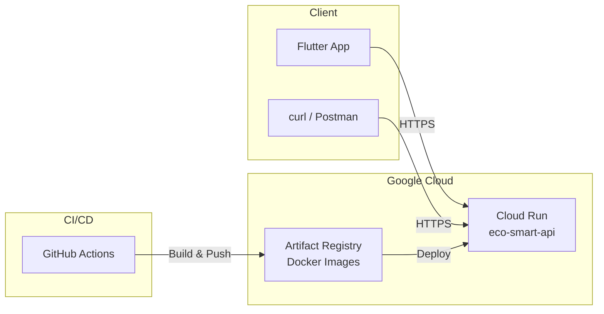

# 🚀 Guide de Déploiement — Eco-Smart Classifier API

> Déploiement de l'API FastAPI de classification des déchets sur **Google Cloud Run**.

---

## Architecture de Déploiement



---

## 1. Prérequis

### 1.1 Outils nécessaires

| Outil | Version min. | Installation |
|-------|-------------|--------------|
| Google Cloud SDK | 450+ | [cloud.google.com/sdk](https://cloud.google.com/sdk/docs/install) |
| Docker | 24+ | [docker.com](https://docs.docker.com/get-docker/) |
| Python | 3.11+ | Déjà installé |

### 1.2 Compte Google Cloud

1. Créer un compte sur [console.cloud.google.com](https://console.cloud.google.com/)
2. Créer un nouveau projet (ex: `eco-smart-classifier`)
3. Activer la facturation (Cloud Run a un **free tier généreux**)

> **💡 Free Tier Cloud Run :**
> - 2 millions de requêtes/mois gratuites
> - 360 000 Go-secondes de mémoire/mois
> - 180 000 vCPU-secondes/mois
> - Largement suffisant pour un projet académique

### 1.3 Authentification

```bash
# Se connecter à Google Cloud
gcloud auth login

# Configurer le projet
gcloud config set project <VOTRE_PROJECT_ID>

# Vérifier
gcloud config get-value project
```

---

## 2. Déploiement Rapide (One-Shot)

### Option A : Script automatique (recommandé)

```bash
cd backend
chmod +x cloud_run_deploy.sh
./cloud_run_deploy.sh
```

Le script va :
1. ✅ Vérifier les prérequis (gcloud, projet)
2. ✅ Activer les API nécessaires
3. ✅ Builder l'image Docker
4. ✅ Déployer sur Cloud Run
5. ✅ Afficher l'URL de l'API

### Option B : Commande manuelle

```bash
# Depuis la racine du projet
gcloud run deploy eco-smart-api \
    --source . \
    --dockerfile Dockerfile.cloud \
    --region europe-west1 \
    --allow-unauthenticated \
    --port 8080 \
    --memory 1Gi \
    --timeout 120 \
    --max-instances 3
```

---

## 3. Vérification du Déploiement

### 3.1 Health Check

```bash
curl https://<VOTRE_URL>/health
```

Réponse attendue :
```json
{
    "status": "healthy",
    "model_loaded": true,
    "model_path": "/app/model/multimodal_model.pkl",
    "uptime_seconds": 42.3
}
```

### 3.2 Test de Prédiction

```bash
curl -X POST https://<VOTRE_URL>/predict \
    -H "Content-Type: application/json" \
    -d '{
        "Rapport_Collecte": "Lot de bouteilles plastiques PET transparent",
        "Poids": 12.5,
        "Volume": 5.0,
        "Conductivite": 0.1,
        "Opacite": 0.8,
        "Rigidite": 0.3,
        "Source": "Centre_Tri"
    }'
```

Réponse attendue :
```json
{
    "prediction": "Plastique",
    "category": "Plastique",
    "prediction_method": "ml_model",
    "model": "eco-smart-multimodal",
    "confidence": 0.98
}
```

### 3.3 Documentation Swagger

Accédez à `https://<VOTRE_URL>/docs` pour la documentation interactive.

---

## 4. Test Local avec Docker

Avant de déployer, testez localement :

```bash
# Build l'image
docker build -f Dockerfile.cloud -t eco-smart-api .

# Lancer le container
docker run -p 8080:8080 eco-smart-api

# Tester
curl http://localhost:8080/health
curl -X POST http://localhost:8080/predict \
    -H "Content-Type: application/json" \
    -d '{"Rapport_Collecte":"test","Poids":10,"Volume":5,"Conductivite":0.1,"Opacite":0.5,"Rigidite":0.3}'
```

---

## 5. CI/CD Automatique (GitHub Actions)

### 5.1 Configuration des Secrets GitHub

Dans votre repo GitHub → Settings → Secrets → Actions, ajoutez :

| Secret | Description | Exemple |
|--------|-------------|---------|
| `GCP_PROJECT_ID` | ID du projet Google Cloud | `eco-smart-classifier` |
| `WIF_PROVIDER` | Workload Identity Federation provider | `projects/123/locations/global/workloadIdentityPools/...` |
| `WIF_SERVICE_ACCOUNT` | Service account email | `github-actions@project.iam.gserviceaccount.com` |

### 5.2 Configuration Workload Identity Federation

```bash
# Créer le pool
gcloud iam workload-identity-pools create "github-pool" \
    --location="global" \
    --display-name="GitHub Actions Pool"

# Créer le provider
gcloud iam workload-identity-pools providers create-oidc "github-provider" \
    --location="global" \
    --workload-identity-pool="github-pool" \
    --display-name="GitHub Provider" \
    --attribute-mapping="google.subject=assertion.sub,attribute.repository=assertion.repository" \
    --issuer-uri="https://token.actions.githubusercontent.com"

# Créer le service account
gcloud iam service-accounts create github-actions \
    --display-name="GitHub Actions"

# Donner les permissions
gcloud projects add-iam-policy-binding <PROJECT_ID> \
    --member="serviceAccount:github-actions@<PROJECT_ID>.iam.gserviceaccount.com" \
    --role="roles/run.admin"

gcloud projects add-iam-policy-binding <PROJECT_ID> \
    --member="serviceAccount:github-actions@<PROJECT_ID>.iam.gserviceaccount.com" \
    --role="roles/artifactregistry.writer"

gcloud projects add-iam-policy-binding <PROJECT_ID> \
    --member="serviceAccount:github-actions@<PROJECT_ID>.iam.gserviceaccount.com" \
    --role="roles/iam.serviceAccountUser"
```

### 5.3 Déclenchement

Le workflow se déclenche automatiquement à chaque push sur `main` qui modifie :
- `backend/**`
- `notebooks/multimodal_model.pkl`
- `Dockerfile.cloud`

Déclenchement manuel possible via l'onglet "Actions" de GitHub.

---

## 6. Endpoints de l'API

| Méthode | Endpoint | Description |
|---------|----------|-------------|
| `GET` | `/` | Info et liens utiles |
| `GET` | `/health` | Health check (status, uptime, modèle) |
| `POST` | `/predict` | Prédiction multimodale |
| `GET` | `/docs` | Documentation Swagger interactive |
| `GET` | `/redoc` | Documentation ReDoc |

---

## 7. Monitoring et Logs

### Voir les logs en temps réel

```bash
gcloud run services logs read eco-smart-api --region europe-west1 --limit 50
```

### Logs continus (streaming)

```bash
gcloud run services logs tail eco-smart-api --region europe-west1
```

### Console Google Cloud

Accédez à [console.cloud.google.com/run](https://console.cloud.google.com/run) pour :
- 📊 Métriques (latence, erreurs, requêtes/sec)
- 📝 Logs détaillés
- ⚙️ Configuration du service
- 📈 Scaling automatique

---

## 8. Mise à Jour de l'API

### Redéployer après modification

```bash
# Depuis la racine du projet
cd backend && ./cloud_run_deploy.sh
```

### Rollback vers une version précédente

```bash
# Lister les révisions
gcloud run revisions list --service eco-smart-api --region europe-west1

# Revenir à une révision précédente
gcloud run services update-traffic eco-smart-api \
    --region europe-west1 \
    --to-revisions <REVISION_NAME>=100
```

---

## 9. Coûts estimés

| Composant | Free Tier | Au-delà |
|-----------|-----------|---------|
| Requêtes | 2M/mois | $0.40/million |
| CPU | 180k vCPU-sec | $0.00002400/vCPU-sec |
| Mémoire | 360k Go-sec | $0.00000250/Go-sec |
| Build | 120 min/jour | $0.003/min |

**Pour un projet académique** : les coûts resteront dans le free tier (< $0).

---

## 10. Résolution de Problèmes

### Le modèle ne se charge pas
```
⚠️  Erreur lors du chargement du modèle : Modèle introuvable
```
→ Vérifiez que `notebooks/multimodal_model.pkl` existe et n'est pas ignoré par `.dockerignore`

### Erreur de mémoire
```
Container memory limit exceeded
```
→ Augmentez la mémoire : `--memory 2Gi`

### Timeout de build
→ La première build peut prendre 5-10 minutes (téléchargement des dépendances Python). Les builds suivantes sont plus rapides grâce au cache.

### Permission denied
```
ERROR: Permission denied on resource project
```
→ Vérifiez les permissions : `gcloud auth list` et `gcloud config get-value project`
